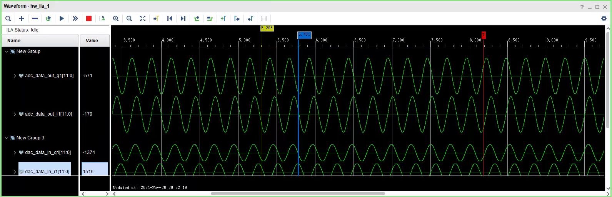
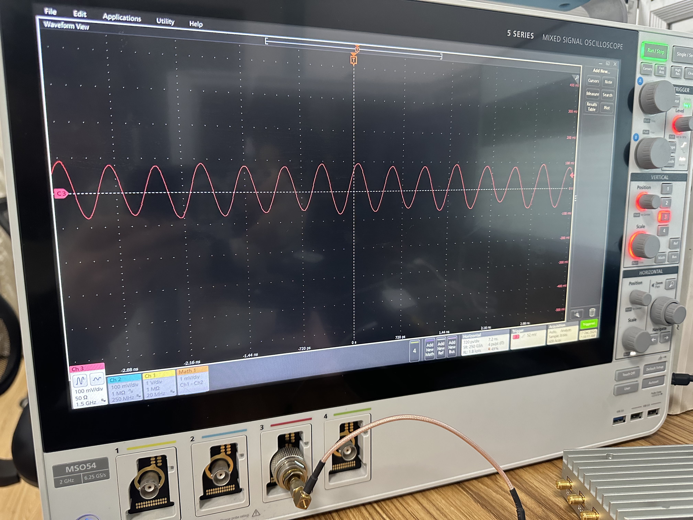

This project is entirely written in Verilog,The single-tone signal is transmitted from TX and received at RX.

1. If your board is different from mine, the code cannot be directly burned and the constraints need to be changed according to the board you are using
2. If your board has hardware reset, you can delete the software reset in the code
3. The configuration mode is LVDS single transmit single receive
4. The VS Code used for code editing, if the comments are garbled, please change the characters to GBK national standard 2312 display (Chinese)

## Experimental Results

